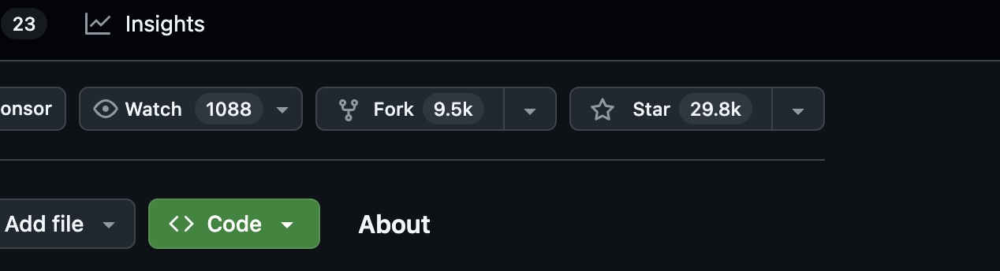
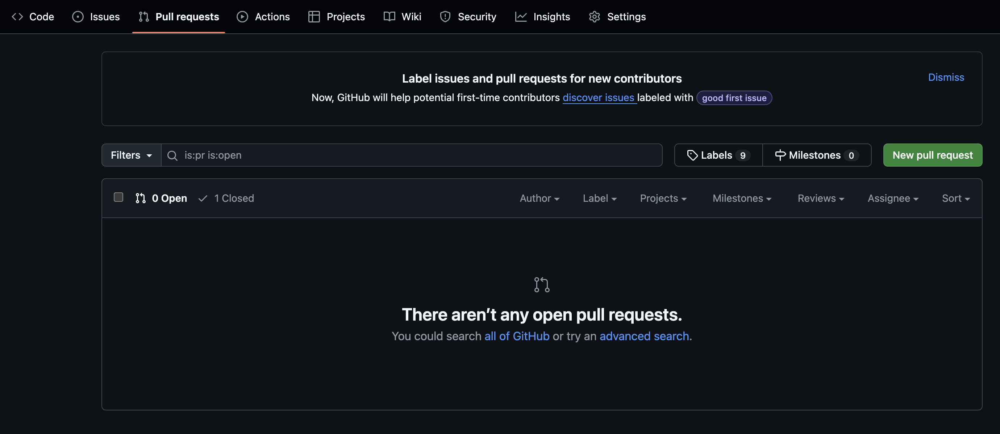

# Database introduction exercices <!-- omit in toc -->

## Table des matières <!-- omit in toc -->

- [Pré-requis](#pré-requis)
- [Rendu](#rendu)
- [Exercices](#exercices)
  - [Exercice 1 /2](#exercice-1-2)
  - [Exercice 2 /3](#exercice-2-3)
  - [Exercice 3 /2](#exercice-3-2)
  - [Exercice 4 /4](#exercice-4-4)
  - [Exercice 5 /5](#exercice-5-5)
  - [Exercice 6 /4](#exercice-6-4)

## Pré-requis

Vous devez savoir ce qu'est un dictionnaire de données, un MCD, programmer une base de données simple et faire des requêtes SQL simples.

Vous devez avoir un compte github.

## Rendu

1. forker ce projet en cliquant sur ce bouton :

Github will clone this repository on your account so you won't modify this template.

Github va ainsi copier ce repository sur votre compte. Vous pourrez travailler sur votre version, et non pas sur ce modèle.

2. Pour chaque exercice, créez un dossier avec comme nom le numéro de l'exercice.

Par exemple pour l'exercice 3, vous créerez un dossier `/Exercice-3`.

3. Vous mettrez dans ces dossiers les fichiers attendus pour répondre aux exercices (tableau pour les dictionnaires de données, image pour les MCD, fichier `.txt` pour les questions à répondre et fichier `.sql` lorsque de la programmation vous est demandé).

Par exemple pour l'exercice 4, vous aurez donc un fichier `/Exercice-4/dictionnaire.csv` et un fichier `/Exercice-4/mcd.png` .

4. Une fois le devoir terminé, vous ferez une Pull Request depuis la page github de votre repository :

Le titre de votre Pull Request devra contenir votre nom, votre prénom et votre classe.

## Exercices

### Exercice 1 /2

Une clinique vétérinaire a besoin d'enregistrer les consultations d'animaux.

Pour faire leur suivi, les informations des animaux sont sauvegardées. La clinique a alors besoin de l'espèce et de la race de l'animal, de son nom, de l'identifiant de sa puce, de sa date de naissance.

Une consultation est identifiée par un numéro. Il faut également enregistrer la date et l'heure du rendez-vous, le nom du docteur, si l'animal s'est présenté et son tarif. Il faut également savoir quel animal était l'objet de la consultation.

1. Écrire le dictionnaire de données

### Exercice 2 /3

Soit le dictionnaire de données suivant :

| Propriété     | Commentaire | Entité        | Type     | Identifiant |
|---------------|-------------|---------------|----------|-------------|
| nom           |             | joueur        | VARCHAR  |             |
| dateNaissance |             | joueur        | DATE     |             |
| nationalite   |             | joueur        | VARCHAR  |             |
| identifiant   |             | joueur        | INT      | X           |
| nom           |             | sponsor       | VARCHAR  | X           |
| joueur        | FOREIGN KEY | sponsor       | INT      |             |
| nom           |             | tournoi       | VARCHAR  | X           |
| date          |             | tournoi       | DATETIME |             |
| adresse       |             | tournoi       | VARCHAR  |             |
| identifiant   |             | participation | INT      | X           |
| joueur        | FOREIGN KEY | participation | INT      |             |
| tournoi       | FOREIGN KEY | participation | VARCHAR  |             |

1. Réaliser le MCD correspondant

### Exercice 3 /2

Soit le MCD suivant :

1. Un patient peut-il effectuer plusieur visites ?
2. Un médecin peut-il recevoir plusieurs patients dans la même consultation ?
3. Peut-on prescrire plusieurs médicaments dans la même consultation ?
4. Un même médicament peut être prescrit par plusieurs médecins différents ?

### Exercice 4 /4

Un fabricant de guitare a besoin de sauvegarder ses modèles de guitare, les devis qu'il propose à ses clients ainsi que les factures qu'il réalise à partir de ces devis.

Les guitares sont identifiées par un nom de modèle. Elles sont caractérisées par un nombre de cordes, un nombre de micro, une matière pour le corps, une matière pour la table et une matière pour le manche.

Un devis est identifié par un numéro. Il contient le nom et le prénom du client. Chaque devis a une date d'envoi. Un devis est relié à un modèle de guitare.

Une facture est identifiée par un numéro. Chaque facture a une date d'envoi et est reliée à un devis. Il faut également savoir si la facture a été payée ou non.

1. Écrire le dictionnaire de données.
2. À partir du dictionnaire, réaliser le MCD.

### Exercice 5 /5

Une école de musique a un site internet sur lequel les visiteurs peuvent envoyer des demandes de contact. Le gérant de l'école a besoin de sauvegarder ces demandes de contact. Le formulaire est le suivant :

L'école doit pouvoir sauvegarder le sujet du contact, pour quel type de cours le contact est fait, la tranche d'âge de la personne qui prend contact, son âge, son nom, son prénom, son email, son numéro de téléphone et son message. L'école à aussi besoin de sauvegarder la date à laquelle la prise de contact a été faite. Pour retrouver les prises de contact, vous utiliserez un identifiant.

1. Écrire le dictionnaire de données.
2. À partir du dictionnaire, réaliser le MCD
3. À partir du MCD, écrire un script `sql` qui permettra de créer la base de données.

### Exercice 6 /4

Soit la base de données `library`, telle que décrite par ce [script](assets/library.sql).

1. Écrire une requête qui permet de lister tous les auteurs encore en vie.
2. Écrire une requête pour sélectioner tous les auteurs français
3. Écrire une requête pour sélectionner tous les livres écrits après 1980.
4. Écrire une requête pour filtrer tous les auteurs qui s'appellent `Jean` mais qui ne sont pas français.
